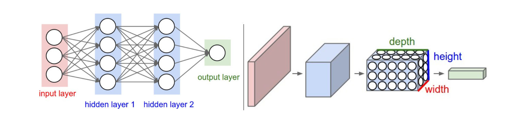
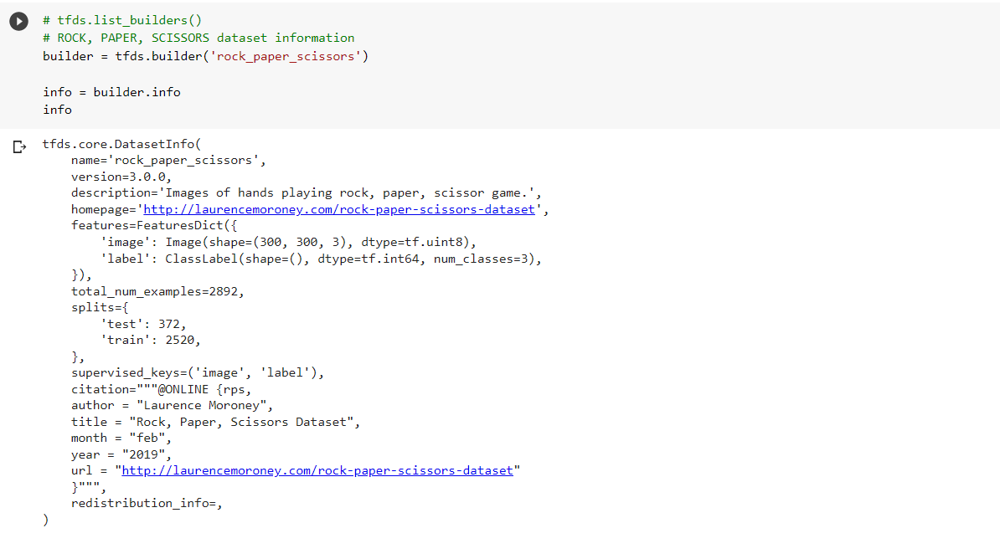
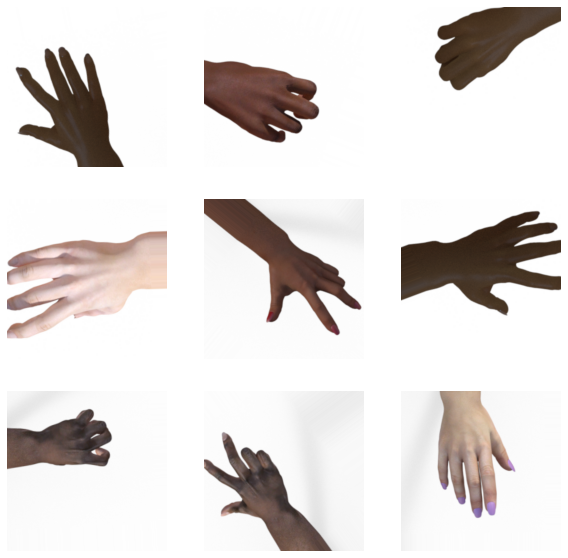
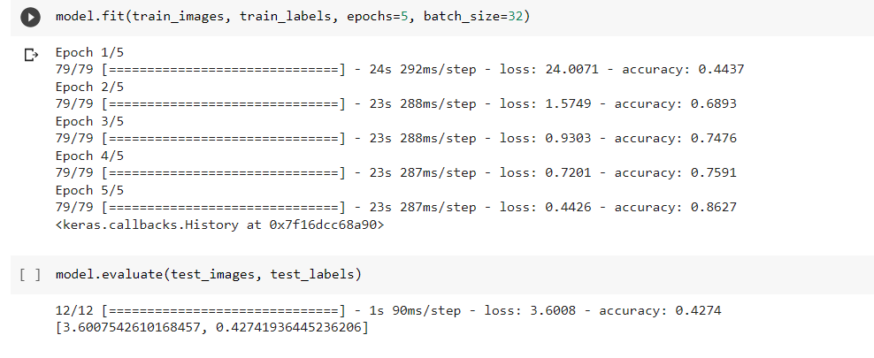
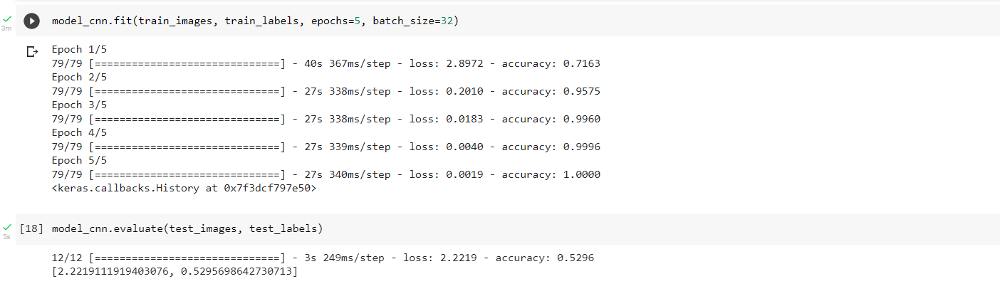
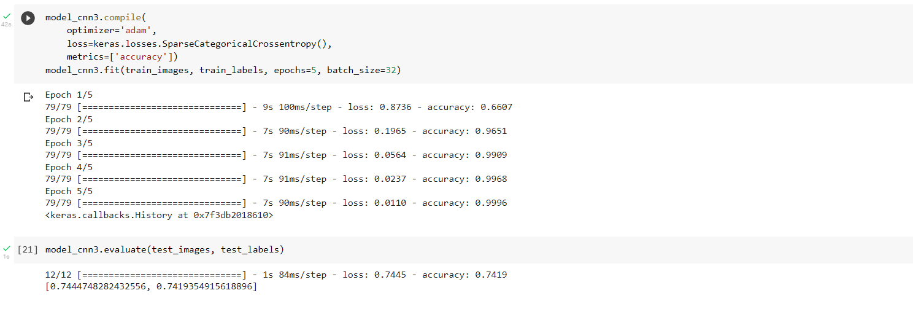
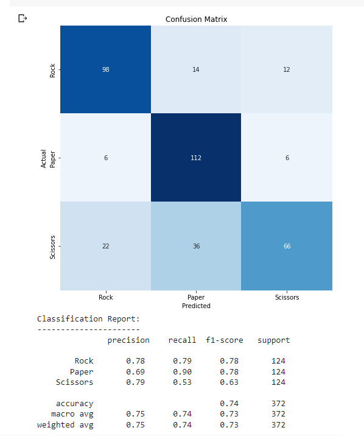

LE BAO QUAN - SE160758 - AI1601

MAI391 Final Project

Link to project on [Github](https://github.com/LeBaoQuan/rock_paper_scissors_classification)


<div align="center">

  # ROCK, PAPER, SCISSORS CLASSIFICATION WITH  MACHINE-LEARNING #
</div>


## __Overview:__

  Purpose of this research paper is to apply the learn and apply Convolutional Neural Network (CNN) model into image classification problem. In particular, to classify between Rock - Paper - Scissors. While doing so, this paper also discussed why CNN model is needed for image processing over basic fully-connected network.

  This paper consists of 7 parts in total:
  Firstly the purposes of this project is mentioned. Secondly, technical background requirements is listed. Then, data exploration. Next, the method of approach is discussed. Build and refine model comes next. Results and in depth discussion will be followed. And lastly, appendix.

## __Background:__

  Basic knowledge for this research includes basic Artificial Neural Network (ANN - fully connected) and Convolutional Neural Network (CNN).

    - comparision between ANN and CNN



  _Basic ANN:_

  - fully connected layers in ANN is sometimes called “densely connected”.

  - All possible connections layer to layer are present, meaning every input of the input vector influences every output of the output vector.

  - However, not all weights affect all outputs.

- Which leads to the needs of CNN, especially in image processing


  _Basic CNN:_

    - Instead of doing all dot products between all weights and inputs, convolutional layer introduces a 'kernel'
    - The kernel shifts along the input matrix (i.e. the image), and get the dot product as usual.
    - By doing do, CNN can effectively perform dot product for input images (which often have very high dimensional input data) in a much shorter time, giving it much more flexibility.
    - A common CNN consists of the following layers
      - Convolutional layers: results in an output of similar width and height, but change in depth (depth = number of filters)
      - ReLU layer: activation function for thresholding at 0, keep the size the same
      - Pool layer: to reduce the size, to prevent overfitting
      - Lastly, a fully connected (Dense) layer to produce the output (shape 1x1xN where N is the number of catergories)

## __Data Preparation:__


  - _Where to get the data:_

      The dataset is taken from Tensorflow Datasets

      ```python
      import tensorflow_datasets as tfds
      builder = tfds.builder('rock_paper_scissors')
      ```

 - Detail information of the dataset is as below:


        * The dataset includes 2520 (test) and 372 (train) images of resolution 300x300 showing rocks, papers or scissors

        * some sample images:
    

  - _Data pre-processing:_  

    - Split into train and test dataset
      ```python
      ds_train = tfds.load(name='rock_paper_scissors', split = 'train')
      ds_test = tfds.load(name='rock_paper_scissors', split = 'test')
      ```
    - Convert images into numpy array
    - Since colors isn't an important factor in this classification problem, we only need 1 color channel

      ```python
      train_images = np.array([example['image'].numpy()[:,:,0] for example in ds_train])
      train_labels = np.array([example['label'].numpy() for example in ds_train])

      test_images = np.array([example['image'].numpy()[:,:,0] for example in ds_test])
      test_labels = np.array([example['label'].numpy() for example in ds_test])
      ```
    - Reshape (add another column (depth) as color channel)

      ```python
      train_images = train_images.reshape(2520,300,300,1)
      test_images = test_images.reshape(372,300,300,1)
      ```
    - Convert data to float values in range (0-1)
      ```python
      train_images = train_images.astype('float32')
      test_images = test_images.astype('float32')

      train_images /= 255
      test_images /= 255
      ```

##  __Approach:__

   - Try both the basic approach Fully-connected Network and CNN (Convolutional Neural Network)
   - Compare the result and explain why CNN is better to be  used for working with images
   - Refine the CNN model to get a better result

## __Building and Refining Model:__

  - _basic ANN model:_
  ```python
  model = keras.Sequential([
    keras.layers.Flatten(),
    keras.layers.Dense(512, activation='relu'),
    keras.layers.Dense(256, activation='relu'),
    keras.layers.Dense(3, activation='softmax')
  ])

  model.compile(
    optimizer='adam',          
    loss=keras.losses.SparseCategoricalCrossentropy(),
    metrics=['accuracy'])

  model.fit(train_images, train_labels, epochs=5, batch_size=32)
```
      - Result and Observation:



          - Even though the accuracy when training the model is great (86%), the actually accuracy of test model is only 42%
          - Next, CNN model will be used to test how much improvement can be achieved

- _basic CNN model:_

```python
model_cnn = keras.Sequential([
  layers.Conv2D(filters=64, kernel_size=3, strides=(1,1), activation='relu', input_shape=(300,300,1)),
  layers.Conv2D(filters=32, kernel_size=3, activation='relu'),
  keras.layers.Flatten(),
  keras.layers.Dense(3, activation='softmax')
])
```
      - Result and Observation:


          - Accuracy on the test dataset has been increase but still 52%
          - This probably due to overfitting problems (as accuracy is perfect with train dataset but mediorce with test dataset)
          - Attempt to solve this problem by introducing pooling layers into the model

- _improved CNN model:_

```python
     from keras.layers.pooling import MaxPool2D
     model_cnn3 = keras.Sequential([
        layers.AveragePooling2D(pool_size=4,strides=2, input_shape=(300,300,1)),                           
        layers.Conv2D(filters=64, kernel_size=3, strides=(1,1), activation='relu'),
        layers.Conv2D(filters=32, kernel_size=3, activation='relu'),
        layers.MaxPool2D(pool_size=2, strides=2),
        keras.layers.Flatten(),
        keras.layers.Dense(3, activation='softmax')
     ])
````
  - _Result and Observation:_

  
      - As can be seen, the accuracy is now almost 75%
      - In the next part, confusion matrix will be used to further evaluate and understand the model

  - _Other methods to improve model:_
       - Using multiple filters and pooling layers alternating between the CNN layers
       - Modern architectures (ResNet, VGGnet, etc) may be applied to achieve better results.

## __Results and Discussion:__


  - _result & evaluate:_

```python
predictions = np.argmax(model_cnn3.predict(test_images), axis=1)
```


  - confusion matrix
```python
from sklearn.metrics import confusion_matrix, classification_report

cm = confusion_matrix(test_labels, predictions, labels=[0, 1, 2])
clr = classification_report(test_labels, predictions, labels=[0, 1, 2], target_names=["Rock", "Paper", "Scissors"])
```
  - _show the result_
  ```python
  import seaborn as sns

  plt.figure(figsize=(8, 8))
  sns.heatmap(cm, annot=True, fmt='g', vmin=0, cmap='Blues', cbar=False)
  plt.xticks(ticks=[0.5, 1.5, 2.5], labels=["Rock", "Paper", "Scissors"])
  plt.yticks(ticks=[0.5, 1.5, 2.5], labels=["Rock", "Paper", "Scissors"])
  plt.xlabel("Predicted")
  plt.ylabel("Actual")
  plt.title("Confusion Matrix")
  plt.show()
  print(clr)
  ```
   - _Evaluate the model:_

   

  - _Discussion:_

      - Paper is the most accurately predicted, follows by Rock and lastly, scissors
      - This observation makes sense because paper and rock are at the 2 extreme case (all fingers stretch, or no finger extends)
      - The use of a proper CNN model has tremendously increase the accuracy (upto 78%) compared to the basic ANN model in image classification
      - This model is also better than many similar others found in Kaggle (which has accuracy around 70%)
      - Further tinkering with the model may achieve even better result.

## __Reference and Appendix:__

1. ANN vs CNN: https://towardsdatascience.com/convolutional-layers-vs-fully-connected-layers-364f05ab460b
2. basic CNN: https://cs231n.github.io/convolutional-networks/
3. Link to google colab: https://colab.research.google.com/drive/1pw2_jrYVWmddWbZDS8xE0COzlrLNb3WR#scrollTo=Gj1fqnEqqpzv
4. Similar projects on Kaggle: https://www.kaggle.com/code/gcdatkin/rock-paper-scissors-image-recognition/notebook
